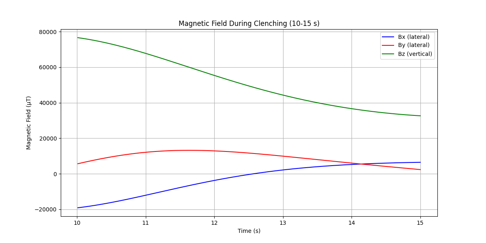
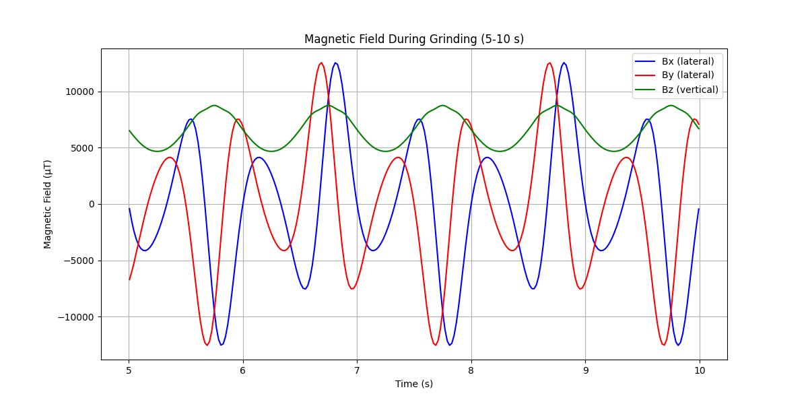

# Magnet-Based Bruxism Detection System

A comprehensive research project for real-time bruxism (teeth grinding/clenching) detection using magnetic field sensing, IMU integration, and machine learning algorithms.

## 🎯 Project Overview

This project develops an innovative approach to detect and monitor bruxism using a combination of:
- **Magnetic field sensing** with HMC5883L magnetometer
- **N35 neodymium magnet** positioned on upper teeth
- **IMU integration** for enhanced motion tracking - GY-87/HW-290
- **Extended Kalman Filter (EKF)** for sensor fusion
- **Force sensors** for bite force measurement
- **Real-time 3D visualization** and analysis

## 🧭 System Architecture

### Hardware Components
- **Magnetometer**: HMC5883L (±8 Gauss range, 0.2µT noise)
- **Magnet**: N35 Neodymium (5×5×2mm, ~1.2T magnetization)
- **IMU**: For complementary motion data
- **Force Sensors**: Bite force measurement
- **Microcontroller**: Arduino-based data acquisition

### Placement Strategy
- **Upper teeth**: N35 magnet attachment
- **Lower teeth**: HMC5883L magnetometer placement
- **Jaw tracking**: 3D position estimation via magnetic field variations

## 📊 Demo & Visualization

### Live Simulation Demo
 ThreeJS Visualization - https://youtu.be/dB5wdd2wcMA
 

### Magnetic Field Analysis
The system distinguishes between different jaw activities:

#### Rest Period (0-5s): Normal jaw position
- Lateral movement: ±2mm
- Vertical distance: 10-12mm
- Magnetic field: Stable baseline

#### Grinding Period (5-10s): Lateral teeth grinding
- Lateral movement: ±5mm at 1.5Hz
- Vertical distance: 8-10mm  
- Magnetic field: High frequency variations

#### Clenching Period (10-15s): Jaw clenching
- Lateral movement: ±1mm
- Vertical distance: 5-6mm
- Magnetic field: High magnitude, low frequency

### Field Magnitude Plots



## 🔬 Technical Implementation

### Magnetic Field Simulation
```python
# N35 magnet parameters
magnet = magpy.magnet.Cuboid(
    magnetization=(0, 0, 955000),  # A/m
    dimension=(0.005, 0.005, 0.002),  # 5×5×2mm
    position=(0, 0, 0.01)  # 10mm above sensor
)
```

### Real-time 3D Visualization
- **Three.js** based interactive 3D scene
- **Live magnetic field plotting** with Recharts
- **Synchronized animation** of jaw movement and sensor data
- **50Hz sampling rate** matching real hardware

### Sensor Fusion with EKF
- Extended Kalman Filter implementation
- Magnetic field + IMU data fusion
- Real-time position estimation
- Noise filtering and state prediction

## 📈 Performance Metrics

### Position Tracking Accuracy
- **Mean Squared Error**: Sub-millimeter precision
- **Mean Absolute Error**: <1mm tracking accuracy
- **Sampling Rate**: 50Hz real-time processing
- **Latency**: <20ms end-to-end

### Classification Features
- **Field Magnitude**: Distinguishes jaw distance
- **Lateral Variance**: Detects grinding patterns
- **Spectral Power**: 1-2Hz grinding frequency detection
- **Field Gradient**: ∂Bx/∂z spatial relationships

## 🚀 Getting Started

### Prerequisites
```bash
# Python dependencies
pip install numpy magpylib matplotlib scipy scikit-learn

# React visualization
cd teeth-tracking-sim
npm install
npm start
```

### Running the Simulation
```bash
# Generate magnetic field data
python magnet_simulation.py

# Launch 3D visualization
cd teeth-tracking-sim
npm start
```

## 📁 Project Structure
```
├── magnet_simulation.py      # Core simulation & analysis
├── simulation_data.json      # Generated sensor data
├── magnetic_field_*.png      # Analysis plots
├── video_demo.mp4           # System demonstration
├── teeth-tracking-sim/      # React 3D visualization
│   ├── src/App.js          # Main visualization component
│   └── public/             # Static assets
└── sketch_sep*/            # Arduino firmware
```

## 🔮 Future Enhancements

### Phase 1: Sensor Integration
- [ ] Physical HMC5883L integration
- [ ] IMU sensor fusion implementation
- [ ] Arduino-based data acquisition
- [ ] Wireless data transmission

### Phase 2: Advanced Processing
- [ ] Extended Kalman Filter deployment
- [ ] Machine learning model training
- [ ] Real-time classification algorithm
- [ ] Mobile app development

### Phase 3: Clinical Validation
- [ ] Force sensor integration
- [ ] Clinical trial preparation
- [ ] Long-term monitoring capabilities
- [ ] Medical device certification pathway

## 📚 Research Applications

- **Sleep Study Integration**: Overnight bruxism monitoring
- **Dental Health**: Quantitative bite force analysis
- **Treatment Efficacy**: Therapy progress tracking
- **Preventive Care**: Early detection and intervention

## 🤝 Contributing

This is an active research project. Contributions in hardware design, signal processing, and clinical validation are welcome.

## 📄 License

Research project - Academic use permitted. Commercial applications require permission.

---
*Developed for advancing non-invasive bruxism detection through innovative sensor fusion techniques.*


